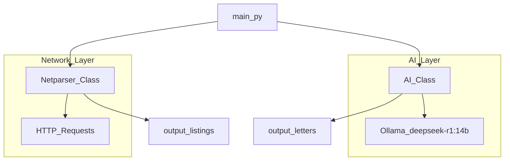

```mermaid
graph TD
    subgraph AI_Layer
        AIClass[AI_Class]
        LLM[Ollama_deepseek-r1:14b]
        AIClass --> LLM
    end

    subgraph Network_Layer
        NetparserClass[Netparser_Class]
        HTTP[HTTP_Requests]
        NetparserClass --> HTTP
    end

    MainApp[main_py] --> NetparserClass
    MainApp --> AIClass

    NetparserClass --> OutputListings[output_listings]
    AIClass --> OutputLetters[output_letters]

```