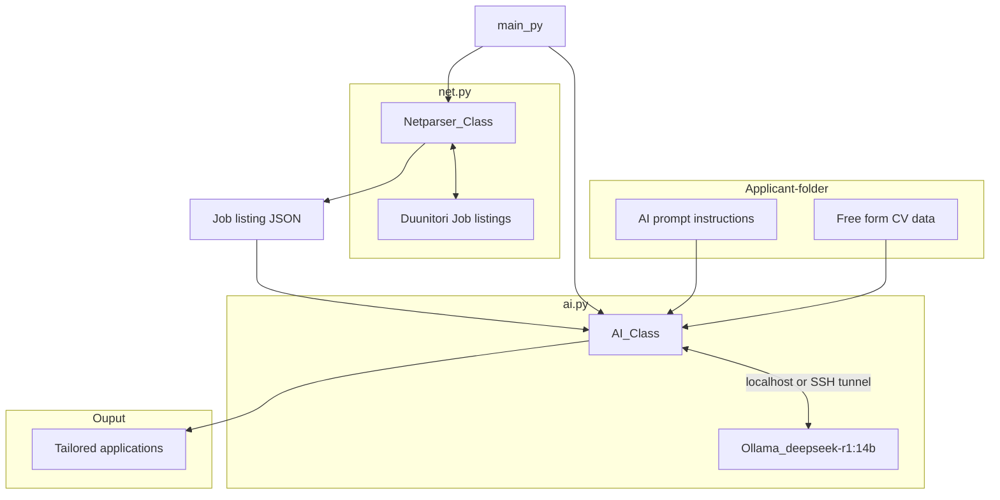

# Job Application Automation Project

This project automates the process of fetching job listings, evaluating them using an LLM, and generating tailored motivation letters for the best-scored positions. 

It consists of three main components:

- _net.py_ 
  - Web scraping & parsing job listings

- ai.py 
  - Interacting with a local LLM (Ollama) for evaluation & letter generation

- main.py 
  - Links net and ai

With additional
- run.sh
  -  At root, handles initialization, venv, libraries, launches python, etc. Main entry point.

## Dataflow
